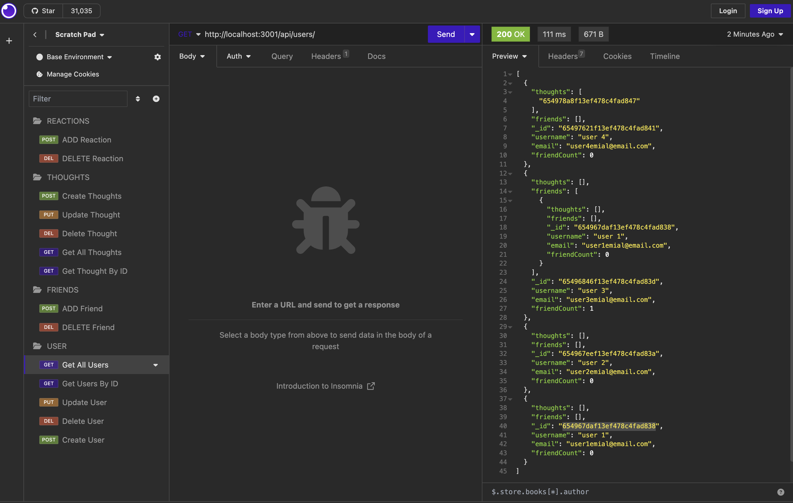

# Social Network

## Table of Contents

- [Description](#description)
- [Technology](#Technology)
- [Installation](#installation)
- [Usage](#usage)

## Description:

The challenge was to build an API for a social network web application where users can share their thoughts, react to friends’ thoughts, and create a friend list. I used Express.js for routing, a MongoDB database, and the Mongoose ODM.

## Technology:

Project is created with:

- Javascript
- Node.js
- Express.js
- MongoDB
- Mongoose

## Installation

To run this project, install it locally using npm:

```
npm install
```

## Usage

After installing npm packages, the application will be invoked by using the following command:

```
npm start
```

#### Walkthrough Video

[Click to see the demo video!] (https://storyxpress.co/video/lonpc3gjmdo7vttot)

#### GitHub Link
https://github.com/mohanbeckford/social

#### Insomnia Screenshot



